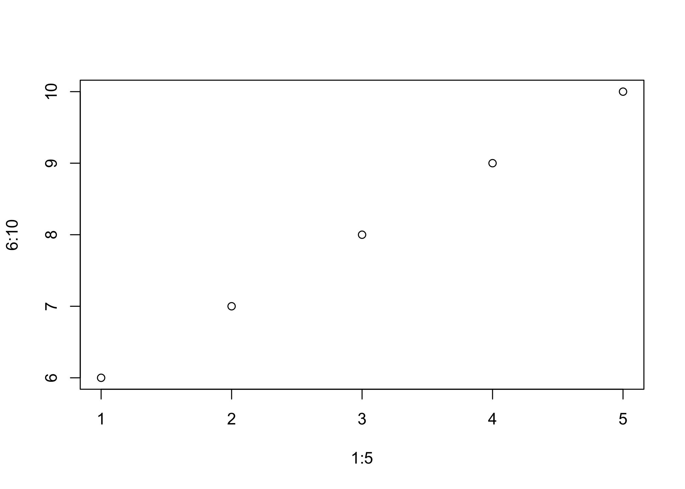
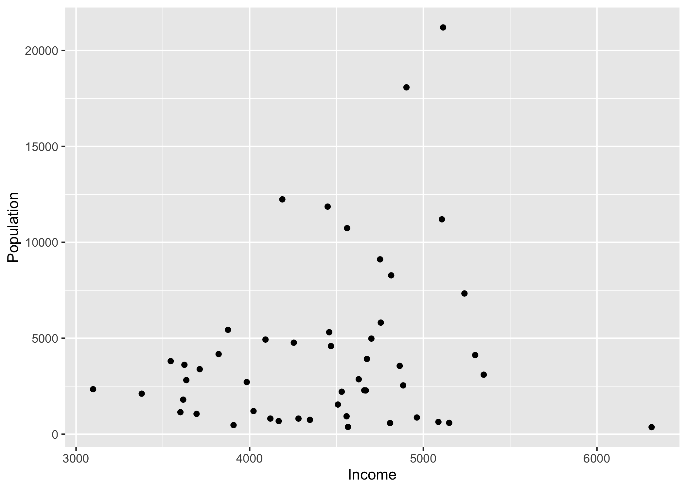
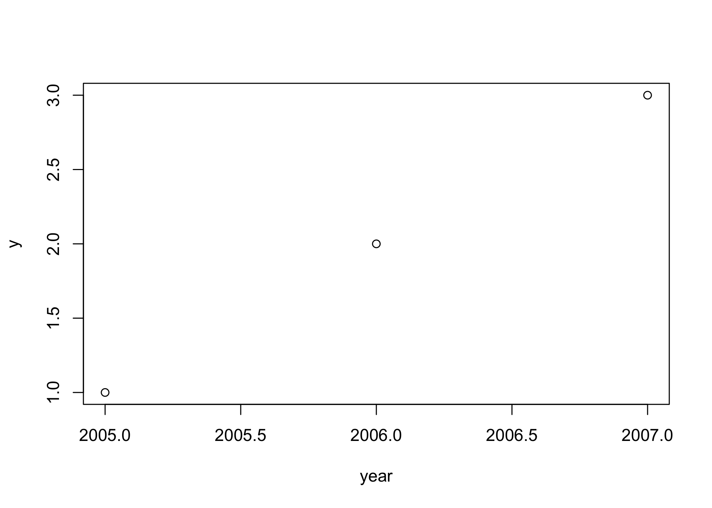
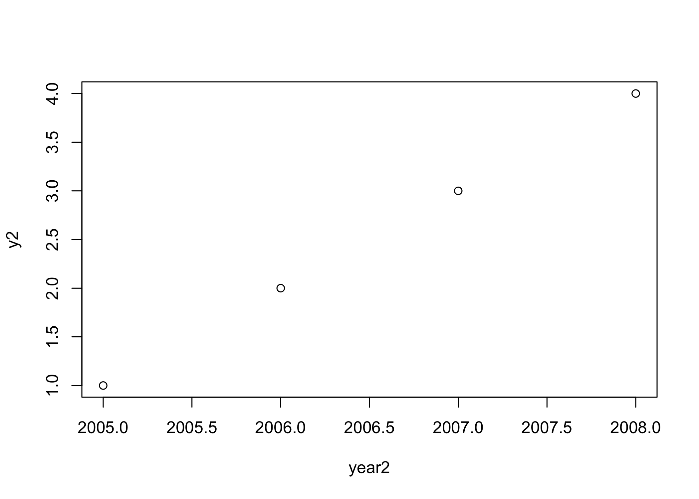
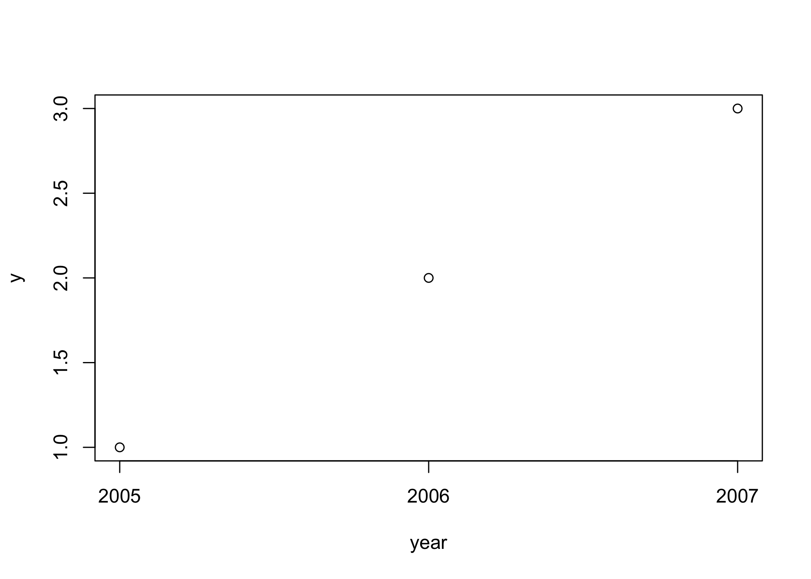
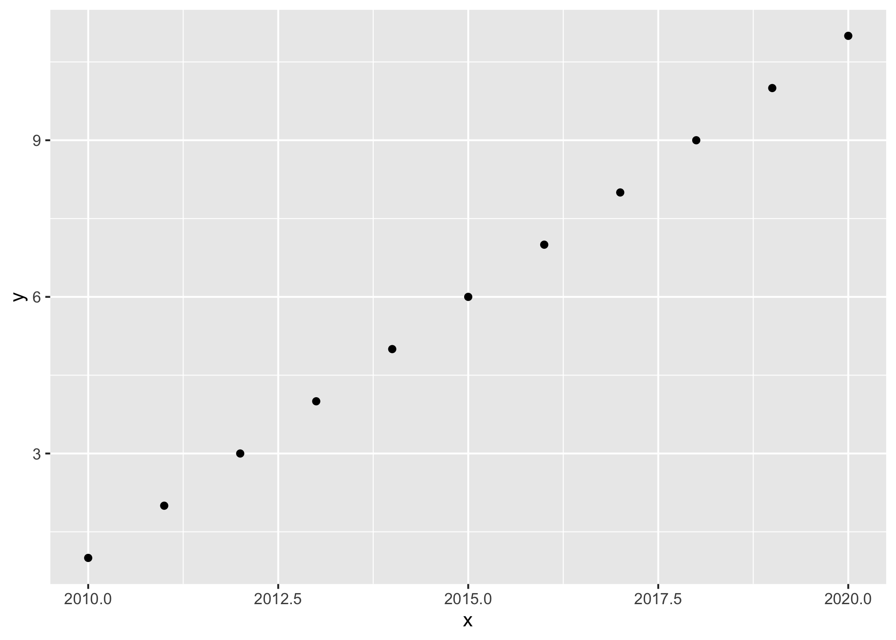
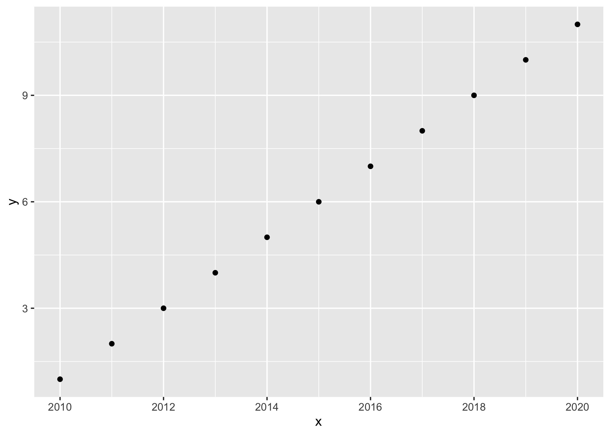

Rメモ
================

<!-- README.md is generated from README.Rmd. Please edit that file -->

- [Rメモ](#rメモ)
- [`$`と`[[]]`の使い方](#との使い方)
- [複数の変数の対数をとる。](#複数の変数の対数をとる)
- [Rマークダウンからマークダウンを生成](#rマークダウンからマークダウンを生成)
- [グローバルチャンクの例](#グローバルチャンクの例)
- [パイプ・オペレータの使い方](#パイプオペレータの使い方)
- [グラフ作成・保存の基本](#グラフ作成保存の基本)
- [回帰分析](#回帰分析)
- [x軸のラベルの不要な小数点の除去](#x軸のラベルの不要な小数点の除去)
  - [plot()関数](#plot関数)
    - [参考](#参考)
  - [ggplot()関数](#ggplot関数)
    - [データを作成](#データを作成)
    - [まず普通のグラフを作成](#まず普通のグラフを作成)
    - [x軸の小数点を消す](#x軸の小数点を消す)
    - [参考](#参考-1)
- [データ名称を変更する: `assign`](#データ名称を変更する-assign)
- [Stataの`forvalues`と同じようにループで連番データを読み込む](#stataのforvaluesと同じようにループで連番データを読み込む)
- [`tapply`の使い方](#tapplyの使い方)
- [パイプ・オペレータ](#パイプオペレータ)
- [交差項](#交差項)
- [`mutate`の使い方](#mutateの使い方)
- [Rでデータをcollapseする方法](#rでデータをcollapseする方法)
- [欠損値の除去](#欠損値の除去)
- [Stata to R](#stata-to-r)
- [RMarkdownとQuatroでの目次自動生成](#rmarkdownとquatroでの目次自動生成)
- [多数の固定効果含むモデルの推定](#多数の固定効果含むモデルの推定)
- [Excelデータの読み込み、書き出し](#excelデータの読み込み書き出し)
- [特定の文字列の言語の識別](#特定の文字列の言語の識別)
- [特定の文字の前後の文字列の切り出し](#特定の文字の前後の文字列の切り出し)
- [R MarkdownでのBibTexの使用](#r-markdownでのbibtexの使用)
- [data.table](#datatable)
- [here](#here)


# `$`と`[[]]`の使い方

- `$`と`[[]]`のいずれを使っても、データの中の特定の変数を指定できる。
- どちらもBase Rのオペレーター。
- 既存変数の対数を作成する例。
- `[[]]`を使う場合、変数名を引用符で囲む必要があることに注意。例）“wage”

``` r
# AERパッケージのデータを使う
library(AER)
#> Loading required package: car
#> Loading required package: carData
#> Loading required package: lmtest
#> Loading required package: zoo
#> 
#> Attaching package: 'zoo'
#> The following objects are masked from 'package:base':
#> 
#>     as.Date, as.Date.numeric
#> Loading required package: sandwich
#> Loading required package: survival
data("CPS1985")

# `$`を用いた変数の指定
CPS1985$lnwage1 = log(CPS1985$wage)

head(CPS1985$lnwage1)
#> [1] 1.629241 1.599388 1.897620 1.386294 2.014903 2.570320

# [[]]を用いた変数の指定
CPS1985[["lnwage2"]] = log(CPS1985[["wage"]])

head(CPS1985$lnwage2)
#> [1] 1.629241 1.599388 1.897620 1.386294 2.014903 2.570320
```

# 複数の変数の対数をとる。

``` r
# 既存データを一旦削除
rm(list =ls())

# AERパッケージのデータを使う
library(AER)
data("CPS1985")

# 対数変換したい変数のリスト
variables <- c("age", "wage")

for (var in variables) {
  # 新しい変数名
  new_var_name <- paste0("ln", var) 
  # 対数変換
  CPS1985[[new_var_name]] <- log(CPS1985[[var]])
}

head(CPS1985$lnwage)
#> [1] 1.629241 1.599388 1.897620 1.386294 2.014903 2.570320

head(CPS1985$lnage)
#> [1] 3.555348 4.043051 2.944439 3.091042 3.555348 3.332205

#CPS1985 <- data.frame(CPS1985) 
```

# Rマークダウンからマークダウンを生成

YAMLの例

    ---
    title: Rメモ
    output: github_document
    ---

# グローバルチャンクの例


    knitr::opts_chunk$set(
      collapse = TRUE,
      comment = "#>",
      fig.path = "figures/fig-",
      out.width = "100%",
      dpi = 300
      )

    knitr::opts_chunk$set(echo = TRUE, #コードを表示
                          cache = FALSE, #キャッシュを残さない
                          fig.path = "figures/fig-",
                          out.width = "100%",
                          dpi = 300,
                          message=FALSE, warning=FALSE)

# パイプ・オペレータの使い方

``` r
1+1
#> [1] 2

a <- 1:3 |> sum()

a
#> [1] 6
```

# グラフ作成・保存の基本

``` r
plot(1:5, 6:10)
```



``` r
library(dplyr)
#> 
#> Attaching package: 'dplyr'
#> The following object is masked from 'package:car':
#> 
#>     recode
#> The following objects are masked from 'package:stats':
#> 
#>     filter, lag
#> The following objects are masked from 'package:base':
#> 
#>     intersect, setdiff, setequal, union

state <- state.x77

library(ggplot2)
ggplot(data = state) +
  geom_point(mapping = aes(x = Income, y = Population) )
```



# 回帰分析

    install.packages("wooldridge")
    install.packages("AER")

``` r
library(wooldridge)

data("wage1")
wageModel <- lm(lwage ~ educ + exper + tenure, data = wage1)

summary(wageModel)
#> 
#> Call:
#> lm(formula = lwage ~ educ + exper + tenure, data = wage1)
#> 
#> Residuals:
#>      Min       1Q   Median       3Q      Max 
#> -2.05802 -0.29645 -0.03265  0.28788  1.42809 
#> 
#> Coefficients:
#>             Estimate Std. Error t value Pr(>|t|)    
#> (Intercept) 0.284360   0.104190   2.729  0.00656 ** 
#> educ        0.092029   0.007330  12.555  < 2e-16 ***
#> exper       0.004121   0.001723   2.391  0.01714 *  
#> tenure      0.022067   0.003094   7.133 3.29e-12 ***
#> ---
#> Signif. codes:  0 '***' 0.001 '**' 0.01 '*' 0.05 '.' 0.1 ' ' 1
#> 
#> Residual standard error: 0.4409 on 522 degrees of freedom
#> Multiple R-squared:  0.316,  Adjusted R-squared:  0.3121 
#> F-statistic: 80.39 on 3 and 522 DF,  p-value: < 2.2e-16
```

# x軸のラベルの不要な小数点の除去

## plot()関数

Rのplot関数でグラフ作成すると、x軸のラベルに不要な小数点がついてしまうことがある。例）2005.0,
2005.5, 2006.0

``` r
year <- c(2005,2006,2007)
y <- c(1,2,3)
plot(year,y)
```



x軸の変数の値を増やすことで、小数点を避けられる場合もあるようだが、以下のようにうまくいかない場合もある。

``` r
year2 <- c(2005,2006,2007,2008)
y2 <- c(1,2,3,4)
plot(year2,y2)
```



その他の方法として、x軸のラベルをplot関数では指定せずに、後から、axis関数で追加する方法がある。

``` r
year <- c(2005,2006,2007)
y <- c(1,2,3)
plot(year,y, xaxt = "n")
# axisの最初の引数1は、x軸を意味する。
axis(1, 2005:2007)
```



yearを時間変数とする方法もある。

### 参考

- [How to get rid of the decimal digits on the x
  axis](https://stackoverflow.com/questions/7556791/how-to-get-rid-of-the-decimal-digits-on-the-x-axis)

## ggplot()関数

- コード例

### データを作成

``` r
x <- 2010:2020
y <- 1:11
data1 <- data.frame(x, y)
```

### まず普通のグラフを作成

``` r
library(ggplot2)
g1 <- ggplot(data = data1) +
  geom_point(mapping = aes(x = x, y = y)) 
g1 
```



### x軸の小数点を消す

``` r
g2 <- g1 + scale_x_continuous(breaks = ~ axisTicks(., log = FALSE)) 
g2
```



### 参考

- [How to avoid default conversion of year into decimals when
  plotting?](https://stackoverflow.com/questions/70596445/how-to-avoid-default-conversion-of-year-into-decimals-when-plotting)

# データ名称を変更する: `assign`

    assign("data_new", data)
    rm(data)

# Stataの`forvalues`と同じようにループで連番データを読み込む

    # 2019年から2023年の役員データを読み込む
    for (i in 2019:2023) {
      # Construct file names
      file_name <- paste0("yakuin_data_", i, ".csv")
      file_name_new <- paste0("yakuin_data_", i, ".RData")
      
      # Read the data
      data <- read.csv(file_name, header = T, fileEncoding = "Shift-JIS")
      
      # Assign data to a variable with its original name
      assign(paste0("data", i), data)
      
    }

# `tapply`の使い方

`tapply`を使うと、属性ごとの平均値を計算できる。

    library(dplyr)
    starwars <- starwars
    height_mean <- tapply(starwars$height, starwars$sex, mean, na.rm=TRUE)
    head(height_mean)

            female hermaphroditic           male           none 
          171.5714       175.0000       179.1228       131.2000 

# パイプ・オペレータ

Base R では `|>` がパイプ演算子。

    1:2 |> mean()

モダンなR（tidyverse）では `%>%` がパイプ演算子。Control + Shift +
m　がショートカット。

    1:2 %>% mean()

ともに左辺が右辺の第一引数となる。

# 交差項

`?formula`で説明がある。

- a\*bは、a + b + a:bと解釈される。
- in%演算子は、 a + b %in% a は a + a:b という式に展開される。
- 演算子 / は省略記法を提供し、a / b は a + b %in% a
  と等価である。つまり、a + a:bと解釈できる。
- 演算子 - は指定された項を削除するので、(a+b+c)^2 - a:b は a + b + c +
  b:c + a:c と同じである。

# `mutate`の使い方

`mutate`は既存の変数に操作を加えて、新しい変数を作成する関数。

    library(dplyr)

    starwars %>%
      select(name, mass) %>%
      mutate(
        mass2 = mass * 2,
        mass2_squared = mass2 * mass2
      )

    library(dplyr)

    starwars <- starwars
    head(starwars) 

    starwars2 <- starwars %>% 
      select(name, mass, species) %>%
      group_by(species) %>%
      mutate(mass_norm = mass / mean(mass, na.rm = TRUE))
      
    head(starwars2)

ここで、`group_by`は、指定した変数ごとに後の`mutate`で平均を計算することを指示するもので、それ自体ではデータに変化を及ぼさない。

# Rでデータをcollapseする方法

方法1

- `aggregate`関数を使えば、集計量を計算できる。

<!-- -->

    A <- state.x77
    a <- aggregate(state.x77, list(Region = state.region), mean)

    C <- warpbreaks
    c <- aggregate(breaks ~ wool + tension, data = warpbreaks, mean)

方法2

    library(doBy)
    hsb2 <- read.table("https://stats.idre.ucla.edu/wp-content/uploads/2016/02/hsb2-1.csv", header=T, sep=",")
    collapse1 <- summaryBy(socst + math ~ prog + ses + female, FUN=c(mean,sd), data=hsb2)
    collapse1 

\-[HOW CAN I “COLLAPSE” MY DATA IN R? \| R
FAQ](https://stats.oarc.ucla.edu/r/faq/how-can-i-collapse-my-data-in-r/)

# 欠損値の除去

- 変数のない行を削除 dat2 \<- subset(dat, !(is.na(dat\$変数)))

- NAがある行はすべて削除 dat2 \<- na.omit(dat)

# Stata to R

- [Stata to R :: CHEAT
  SHEET](https://raw.githubusercontent.com/rstudio/cheatsheets/master/stata2r.pdf)
  チートシート
- [Getting Started in
  R\<-\>Stata](https://www.princeton.edu/~otorres/RStata.pdf)
  2010年版。昔ながらのRコード。
- [R FOR STATA USERS](https://www.matthieugomez.com/statar/)
  tidyverseを使った現代的なRコード。
- [Translating Stata to R](https://stata2r.github.io/)
  data.tableによるデータ処理、fixestを使った推定を中心とした解説。
- [Translating Stata to
  R](https://epi-stats.github.io/Rtutorials/Stata_to_R)　アルファベット順のコード解説。

# RMarkdownとQuatroでの目次自動生成

- 「toc:
  true」を記載。オプションは種々ある。[参考](https://bookdown.org/yihui/rmarkdown/html-document.html)
- 「html_document:」のように「html_document」の後ろに「:」を入れる。「:」を入れ忘れるとエラーになるので注意。

例) RMarkdownの場合

    ---
    title: "伝統的な重力方程式の推定"
    author: "田中 鮎夢"
    date: "2024-11-28"
    output:
      html_document:
        toc: yes
        toc_float: yes
        number_sections: yes
    bibliography: ref.bib
    link-citations: yes
    ---

例) Quatroの場合

    ---
    title: "ユニクロの縫製工場の地図 (ggplot2)"
    author: "Ayumu Tanaka"
    format: html
    toc: true
    toc_float: true
    number-sections: true
    editor: visual
    ---

# 多数の固定効果含むモデルの推定

- Laurent Berge and Grant McDermott. [fixest – Fast Fixed-Effects
  Estimation: Short
  Introduction](https://cran.r-project.org/web/packages/fixest/vignettes/fixest_walkthrough.html#12_Clustering_the_standard-errors)

- [使い方](https://rpubs.com/ayumu21/fixest_walkthrough)

# Excelデータの読み込み、書き出し

    library(readxl)
    ABCD <- read_excel("ABCD.xlsx")

    library("openxlsx")
    write.xlsx(ABCD, "ABCD.xlsx")

# 特定の文字列の言語の識別

    library(cld3)
    detect_language("日本語")

- 言語コードは、[cld3](https://github.com/google/cld3#readme)に記載あり。

# 特定の文字の前後の文字列の切り出し

[特定の文字の前後を抜き出す](https://rpubs.com/dfirr/1029033)

例) 「stringr」パッケージを用いて、「//」の後の文字列を切り出す。

    library(stringr)
    JPN <- str_split_i("The Antique: Secret of the Old Books // ビブリア古書堂の事件手帖", "//", i = -1)

# R MarkdownでのBibTexの使用

- 冒頭に、「bibliography: ref.bib」と書き入れておく。
- 「ref.bib」ファイルに文献情報を記載しておく。
- 本文で文献を引用するときは、「@joseph2022effect」のように「@key」とする。
- 自動的に文献リストが生成される。
- 参考) [4.5
  参考文献と引用](https://gedevan-aleksizde.github.io/rmarkdown-cookbook/bibliography.html)

例）

    ---
    title: "Bibtexの練習"
    author: "田中鮎夢"
    date: "2023-12-12"
    output:
      html_document: default
    bibliography: ref.bib
    ---

    @joseph2022effect はハイチの研究

    # 参考文献

# data.table

- 大規模データの読み込み
- <https://okumuralab.org/~okumura/stat/datatable.html>
- <http://kohske.github.io/ESTRELA/201410/index.html>

# here

- パッケージhereは、相対パスを使うためのもの。
- Posit Cloudでは、hereはルートディレクトリーを”/cloud/project”と認識。
- 例えば、“/cloud/project/qss/INTRO/UNpop.csv”を読み込む時は、以下のようにする。

<!-- -->

    #データの読み込み例
    library(here)
    a <- read.csv(here("qss", "INTRO", "UNpop.csv"))

- 作業ディレクトリ自体をサブフォルダ”/cloud/project/qss/INTRO”に変更するには、以下のようにする。

<!-- -->

    #作業ディレクトリの変更(1)
    library(here)
    setwd(here("qss", "INTRO"))
    getwd()

    #作業ディレクトリの変更(2)
    library(here)
    i_am("qss/INTRO/chap01.Rmd") #Rマークダウンがある場所をルートディレクトリからの相対パスとして表現
    setwd(here("qss", "INTRO"))
    getwd()
