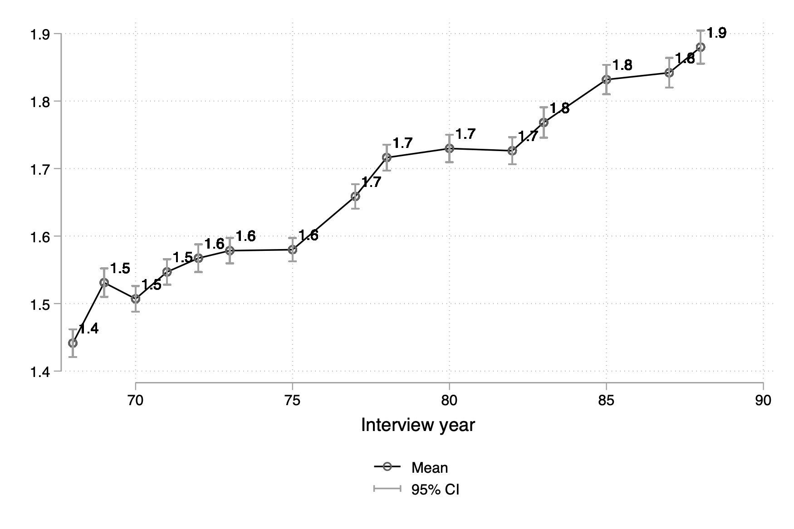

# 研究メモ
--------

- [研究メモ](#研究メモ)
- [R](#r)
  - [RPubs](#rpubs)
  - [Stata to R](#stata-to-r)
  - [RMarkdownとQuatroでの目次自動生成](#rmarkdownとquatroでの目次自動生成)
  - [多数の固定効果含むモデルの推定](#多数の固定効果含むモデルの推定)
  - [Excelデータの読み込み、書き出し](#excelデータの読み込み書き出し)
  - [特定の文字列の言語の識別](#特定の文字列の言語の識別)
  - [特定の文字の前後の文字列の切り出し](#特定の文字の前後の文字列の切り出し)
  - [R MarkdownでのBibTexの使用](#r-markdownでのbibtexの使用)
  - [data.table](#datatable)
  - [here](#here)
- [Stata](#stata)
  - [変数の値をローカルに保存し、繰り返し実行 (levelsof)](#変数の値をローカルに保存し繰り返し実行-levelsof)
  - [欠損値の確認](#欠損値の確認)
  - [変数の平均(もしくは中央値)と信頼区間（もしくは箱ひげ図）の推移を可視化する](#変数の平均もしくは中央値と信頼区間もしくは箱ひげ図の推移を可視化する)
    - [boxpanelを用いる方法](#boxpanelを用いる方法)
    - [stripplotを使う方法](#stripplotを使う方法)
    - [PLOT\_CONFIDENTLYを使う方法](#plot_confidentlyを使う方法)
    - [自力でコード書く方法](#自力でコード書く方法)
  - [Stataの文字列関数](#stataの文字列関数)
  - [他の変数の値を使って、変数ラベルを付与する（labmask）](#他の変数の値を使って変数ラベルを付与するlabmask)
  - [whileを使った繰り返し](#whileを使った繰り返し)
  - [政府統計のエンコード変換](#政府統計のエンコード変換)
  - [2x2の表をLaTex形式でエクスポート](#2x2の表をlatex形式でエクスポート)
  - [パネルデータの欠損値の穴埋め](#パネルデータの欠損値の穴埋め)
  - [データのチェック](#データのチェック)
  - [January2013から、Januaryを抜き出す](#january2013からjanuaryを抜き出す)
  - [文字列の抜き出し](#文字列の抜き出し)
  - [変数ラベル、変数名に特定の文字列を含む変数を探す。](#変数ラベル変数名に特定の文字列を含む変数を探す)
  - [特定の文字列を変数ラベルから除去する](#特定の文字列を変数ラベルから除去する)
  - [変数ラベルに特定の文字列を追加する](#変数ラベルに特定の文字列を追加する)
  - [アンバランスド・パネルをバランスド・パネルに変換する](#アンバランスドパネルをバランスドパネルに変換する)
  - [個体数が多すぎてencodeで使えない場合の対処策](#個体数が多すぎてencodeで使えない場合の対処策)
  - [geoplot](#geoplot)
  - [結合したグラフでX軸/Y軸のタイトルを共通にする](#結合したグラフでx軸y軸のタイトルを共通にする)
  - [globalの数値桁数を指定して、グラフに表示する](#globalの数値桁数を指定してグラフに表示する)
  - [会社名、企業名検索](#会社名企業名検索)
  - [変数ラベル使って変数名変更](#変数ラベル使って変数名変更)
  - [文字列n.a.を除き、変数を数値化(1)](#文字列naを除き変数を数値化1)
  - [文字列n.a.を除き、変数を数値化(2)](#文字列naを除き変数を数値化2)
  - [変数名使って変数ラベル変更](#変数名使って変数ラベル変更)
  - [変数名リストをExcelに出力](#変数名リストをexcelに出力)
  - [graph combine / grc1leg: 複数のグラフの結合。](#graph-combine--grc1leg-複数のグラフの結合)
  - [texで複数のグラフを配置](#texで複数のグラフを配置)
    - [コード例1)２つのグラフ](#コード例1２つのグラフ)
    - [コード例2)４つのグラフ](#コード例2４つのグラフ)
  - [国名から国名コード（ISO3など）の変数作成](#国名から国名コードiso3などの変数作成)
    - [例1](#例1)
    - [例2](#例2)
  - [Stataの時間処理](#stataの時間処理)
    - [英語の月名の数値変換](#英語の月名の数値変換)
    - [Stata: 日付、年月の処理](#stata-日付年月の処理)
    - [weekly data](#weekly-data)
    - [Stata: 年齢や日数計算](#stata-年齢や日数計算)
    - [Stata: Excelのシリアル値形式の日付の変換](#stata-excelのシリアル値形式の日付の変換)
  - [Stata VS codeからの実行](#stata-vs-codeからの実行)
  - [相関行列のLatex形式のテーブル](#相関行列のlatex形式のテーブル)
  - [複数行の注があるLatex形式のテーブル（方法1）](#複数行の注があるlatex形式のテーブル方法1)
  - [複数行の注があるLatex形式のテーブル（方法2）](#複数行の注があるlatex形式のテーブル方法2)
- [VS code](#vs-code)
  - [２画面表示](#２画面表示)
- [Overleaf](#overleaf)
  - [マルチカーソル](#マルチカーソル)
  - [日本語論文の設定](#日本語論文の設定)


<!--
[R](#R) | [Stata](#Stata) | [Overleaf](#Overleaf)
-->


<a id="R"></a>
# R

## RPubs

- [RPubs](https://rpubs.com/ayumuR)

## Stata to R

- [Stata to R :: CHEAT SHEET](https://raw.githubusercontent.com/rstudio/cheatsheets/master/stata2r.pdf) チートシート
- [Getting Started in R<->Stata](https://www.princeton.edu/~otorres/RStata.pdf) 2010年版。昔ながらのRコード。
- [R FOR STATA USERS](https://www.matthieugomez.com/statar/) tidyverseを使った現代的なRコード。
- [Translating Stata to R](https://stata2r.github.io/) data.tableによるデータ処理、fixestを使った推定を中心とした解説。
- [Translating Stata to R](https://epi-stats.github.io/Rtutorials/Stata_to_R)　アルファベット順のコード解説。

## RMarkdownとQuatroでの目次自動生成
- 「toc: true」を記載。オプションは種々ある。[参考](https://bookdown.org/yihui/rmarkdown/html-document.html)
- 「html_document:」のように「html_document」の後ろに「:」を入れる。「:」を入れ忘れるとエラーになるので注意。

例) RMarkdownの場合

```
---
title: "伝統的な重力方程式の推定"
author: "田中 鮎夢"
date: "`r Sys.Date()`"
output:
  html_document:
    toc: yes
    toc_float: yes
    number_sections: yes
---
```

例) Quatroの場合
```
---
title: "ユニクロの縫製工場の地図 (ggplot2)"
author: "Ayumu Tanaka"
format: html
toc: true
toc_float: true
number-sections: true
editor: visual
---
```


## 多数の固定効果含むモデルの推定

- Laurent Berge and Grant McDermott. [fixest -- Fast Fixed-Effects Estimation: Short Introduction](https://cran.r-project.org/web/packages/fixest/vignettes/fixest_walkthrough.html#12_Clustering_the_standard-errors)

- [使い方](https://rpubs.com/ayumu21/fixest_walkthrough)
  

## Excelデータの読み込み、書き出し

```
library(readxl)
ABCD <- read_excel("ABCD.xlsx")

library("openxlsx")
write.xlsx(ABCD, "ABCD.xlsx")
```


## 特定の文字列の言語の識別

```
library(cld3)
detect_language("日本語")
```
- 言語コードは、[cld3](https://github.com/google/cld3#readme)に記載あり。

## 特定の文字の前後の文字列の切り出し

[特定の文字の前後を抜き出す](https://rpubs.com/dfirr/1029033)

例)
「stringr」パッケージを用いて、「//」の後の文字列を切り出す。
```
library(stringr)
JPN <- str_split_i("The Antique: Secret of the Old Books // ビブリア古書堂の事件手帖", "//", i = -1)
```


## R MarkdownでのBibTexの使用

- 冒頭に、「bibliography: ref.bib」と書き入れておく。
- 「ref.bib」ファイルに文献情報を記載しておく。
- 本文で文献を引用するときは、「@joseph2022effect」のように「@key」とする。
- 自動的に文献リストが生成される。
- 参考) [4.5 参考文献と引用](https://gedevan-aleksizde.github.io/rmarkdown-cookbook/bibliography.html)

例）

```
---
title: "Bibtexの練習"
author: "田中鮎夢"
date: "2023-12-12"
output:
  html_document: default
bibliography: ref.bib
---

@joseph2022effect はハイチの研究

# 参考文献
```


## data.table
- 大規模データの読み込み
- [https://okumuralab.org/~okumura/stat/datatable.html](https://okumuralab.org/~okumura/stat/datatable.html)
- [http://kohske.github.io/ESTRELA/201410/index.html](http://kohske.github.io/ESTRELA/201410/index.html)

## here
- パッケージhereは、相対パスを使うためのもの。
- Posit Cloudでは、hereはルートディレクトリーを"/cloud/project"と認識。
- 例えば、"/cloud/project/qss/INTRO/UNpop.csv"を読み込む時は、以下のようにする。

```
#データの読み込み例
library(here)
a <- read.csv(here("qss", "INTRO", "UNpop.csv"))
```

- 作業ディレクトリ自体をサブフォルダ"/cloud/project/qss/INTRO"に変更するには、以下のようにする。

```
#作業ディレクトリの変更(1)
library(here)
setwd(here("qss", "INTRO"))
getwd()
```

```
#作業ディレクトリの変更(2)
library(here)
i_am("qss/INTRO/chap01.Rmd") #Rマークダウンがある場所をルートディレクトリからの相対パスとして表現
setwd(here("qss", "INTRO"))
getwd()
```

<a id="Stata"></a>
# Stata

## 変数の値をローカルに保存し、繰り返し実行 (levelsof)

- コード例

```
sysuse auto,clear
levelsof foreign, local(type)
foreach i of local type {
su mpg if foreign==`i'
scalar mean_`i'=r(mean) 
}
di mean_0
di mean_1
```

- levelsofは、dsと似ているが、用途がやや違う。


## 欠損値の確認

```
misstable
```

```
mdesc
```

## 変数の平均(もしくは中央値)と信頼区間（もしくは箱ひげ図）の推移を可視化する

### boxpanelを用いる方法
- 中央値を繋いだ箱ひげ図。 オプションのjoinmedianで中央値をつなげることができる。
- コンピューターへの負荷が大きい。

```
* パッケージのインストール
ssc install boxpanel
* データの読み込み
use https://www.stata-press.com/data/r17/nlswork.dta,clear
boxpanel ln_wage year, joinmedian
```

### stripplotを使う方法
```
* パッケージのインストール
*ssc install stripplot
* データ読み込み
use https://www.stata-press.com/data/r18/nlswork.dta, clear
*平均値の作成
bys year: egen meanln_wage=mean(ln_wage)
*グラフ作成
*ここで、addplot(connect mean rep78,sort)で、平均値をつなげるグラフを追加している
*オプションのboxは箱を作成している。
stripplot ln_wage, over(year) box ms(none) vertical addplot(connect meanln_wage year,sort ) 
graph export stripplot.png,replace

```


### PLOT_CONFIDENTLYを使う方法
- 指定した変数の平均と信頼区間を可視化するStataモジュール
- 注意：デフォルトでは、x軸のラベルが、0, 5, 10, 15になっているため、x軸のラベルxlabel(0 "1968" 5 "1973" 10 "1978" 15 "1983")と年次に変換している。

```
use https://www.stata-press.com/data/r18/nlswork.dta, clear
ssc install plot_confidently
plot_confidently ln_wage, over(year) /// 
graphopts(vertical xtitle(year) ytitle(ln_wage) mlabgap(relative3p5) ///
xlabel(0 "1968" 5 "1973" 10 "1978" 15 "1983"))
```

- グループ別の推移

```
use https://www.stata-press.com/data/r18/nlswork.dta, clear
ssc install plot_confidently

* ラベルの値を定義しておかないとエラーになる
label define collgrad 0 "High School" 1 "Colledge"
label values collgrad collgrad

* グラフ
plot_confidently ln_wage, over(year) by(collgrad) ///
graphopts(vertical xtitle(year) ytitle(ln_wage) mlabgap(relative3p5) ///
 xlabel(0 "1968" 5 "1973" 10 "1978" 15 "1983"))  
graph export plot_confidently2.png,replace

```


### 自力でコード書く方法
- 平均値の推移をグラフにするだけなら、以下のコードで可能。

```
use https://www.stata-press.com/data/r18/nlswork.dta, clear
bys year: egen meanln_wage=mean(ln_wage)
	format %12.1f meanln_wage 
twoway (connected meanln_wage year, sort mlabel(meanln_wage) mlabposition(12) mlabgap(relative1p5)), xlabel(68(5)88)
twoway (connected meanln_wage year, sort mlabel(meanln_wage) mlabposition(12) mlabgap(relative1p5))
```

- 平均値と25/75パーセンタイルの推移をグラフにする。
  
```
use https://www.stata-press.com/data/r18/nlswork.dta, clear
bys year: egen meanln_wage=mean(ln_wage)
format %12.1f meanln_wage 
bys year: egen ln_wage75=pctile(ln_wage), p(75)
bys year: egen ln_wage25=pctile(ln_wage), p(25)
twoway (connected meanln_wage year, mlabel(meanln_wage) mlabposition(1) mlabgap(relative1p5)) (rcap ln_wage25 ln_wage75 year, sort), legend(order(1 "Mean" 2 "25th and 75th percentiles") position(6))
graph export percentile.png,replace

```

 


- 平均値と信頼区間の推移をグラフにする

```
use https://www.stata-press.com/data/r18/nlswork.dta, clear
bys year: egen meanln_wage=mean(ln_wage)
format %12.1f meanln_wage 

* 信頼区間をciで計算する。
g ln_wageub=.
g ln_wagelb=.

forval i = 68/88 {
	ci means ln_wage if year==`i'
	replace ln_wageub=`r(ub)' if  year==`i'
	replace ln_wagelb=`r(lb)' if  year==`i'
	
}

twoway (connected meanln_wage year, mlabel(meanln_wage) mlabposition(1) mlabgap(relative1p5)) (rcap ln_wagelb ln_wageub year, sort), legend(order(1 "Mean" 2 "95% CI") position(6))
graph export ci.png,replace

```

 


- グループ別に平均値と信頼区間の推移をグラフにする

```
use https://www.stata-press.com/data/r18/nlswork.dta, clear
collapse (mean) mean= ln_wage (sd)sd=ln_wage (count) n=ln_wage, by(year collgrad)
format %12.2f mean
g ub= mean+(1.96*sd)/sqrt(n)
g lb= mean-(1.96*sd)/sqrt(n)
rename collgrad group
global group0 "Control"
global group1 "Treatment"

twoway (connected mean year if group ==0, mlabel(mean) mlabposition(1) mlabgap(relative1p5)) (rcap lb ub year if group ==0, sort) ///
(connected mean year if group ==1, mlabel(mean) mlabposition(1) mlabgap(relative1p5)) (rcap lb ub year if group ==1, sort) ///
 , legend(order(1 "$group0: Mean" 2 "$group0: 95%CI" 3 "$group1: Mean" 4 "$group1: 95%CI") position(6) rows(2)) xline(1998)

 graph export ci2.png
 
```

 


- その他の方法
  - [Line chart with 95% confidence interval in Stata](https://mbounthavong.github.io/Stata_line_plot_95-percent_CI/)


## Stataの文字列関数

- ヘルプ
```
help string_functions
```

- 文字列の一部置換(ustrregexrf)
- コード例
```
replace KSFNationNameAlph = ustrregexrf(KSFNationNameAlph, "Kingdom of ", "")
replace KSFNationNameAlph = ustrregexrf(KSFNationNameAlph, "Republic of ", "")
```


## 他の変数の値を使って、変数ラベルを付与する（labmask）

- コード例
- 例えば、KSFNationCode = 304 に KSFNationNameAlph = United States というラベルを付与する。
```
labmask KSFNationCode, values(KSFNationNameAlph)
```
- [ HOW DO I ASSIGN THE VALUES OF ONE VARIABLE AS THE VALUE LABELS FOR ANOTHER 
 VARIABLE?](https://stats.oarc.ucla.edu/stata/faq/how-do-i-assign-the-values-of-one-variable-as-the-value-labels-for-another-variable/)

## whileを使った繰り返し

- コード例
```
local i=0
while `i'<=2 {
local i=`i'+1
	by KSFNationCode, sort:replace KSFNationNameAlph=KSFNationNameAlph[_n+1] if year<2018
}
```

## 政府統計のエンコード変換

- 政府統計はShift_JISのテキストファイルで提供されていることが多い。
- 原則Unicodeとなっている最近のStataでShift_JISのテキストファイルを読み込むと、日本語部分に文字化けが生じる。
- そのため、DTAファイルとして保存したあと、エンコードをUnicodeに変換する必要がある。

 - ＜Unicode変換のコマンド例＞

```
* 最初にデータを空にする必要がある
clear

* エンコード変更のために作業フォルダをデータがあるフォルダ（例/Users/XXX/Desktop）とする
cd /Users/XXX/Desktop
* 元々のエンコードがShift_JISであることを設定
unicode encoding set Shift_JIS
* エンコード変更（全てのDTAファイル）
unicode translate *.dta
```
- 参考：[Unicodeへの変換](http://www.math-koubou.jp/tb033.html)


## 2x2の表をLaTex形式でエクスポート

- tableで2x2の表を作成した後、Table builderでカスタマイズすることができる。
- Table builderの使い方は、Youtubeの解説でわかる。

コード例）
```
* 2x2の表を作成
table ( year ) ( foreign_owned ) () if provinceorstateaddressofincorp=="CA", statistic(frequency)

* タイトル追加
collect title "Foreign owned firms in CA, USA \label{tab:CA}"
* Notes追加
collect notes `"Notes: A foreign-owned firm is defined as one whose global ultimate owner belongs to a foreign country."'
* 縦線削除
collect style cell, border( right, pattern(nil) )
* 表頭のラベル変更
collect label dim foreign_owned "Foregin owned firm", modify
collect label levels foreign_owned 0 "No", modify
collect label levels foreign_owned 1 "Yes", modify
* 表を出力
collect export "../Tables/CA.tex", replace tableonly 
```


## パネルデータの欠損値の穴埋め

例1）
```
* 欠けている月次に変数の値を埋める
sort stock_code ym
foreach var in  ymd y  res yyyymm isin firmnameJ firmname {
	bys stock_code: replace `var' = `var'[_n-1] if missing(`var')
}
```

例2)
```
* パネルデータで欠けている値の補完
sort iso_code year
foreach var in  country countyjp eu_accession eu_exit {
	local i=0
	while `i'<=75 {
	local i=`i'+1
	* 後方補完
	bys iso_code : replace `var' = `var'[_n-1] if missing(`var')
	* 前方補完
	bys iso_code : replace `var' = `var'[_n+1] if missing(`var')
	}
}
```


## データのチェック

- **assert**: 間違いがあれば、以後のプログラムを停止する
  
```
. sysuse bplong,clear
(Fictional blood-pressure data)

. replace sex = 3 in 1
(1 real change made)

. assert sex == 0 | sex == 1
1 contradiction in 240 observations
assertion is false
r(9);

```


## January2013から、Januaryを抜き出す

- 変数myearにJanuary2013が値として含まれているとき、新規変数mにJanuaryを入れる。

```
g m=substr(myear, 1, strpos(myear,"2")-1)
```
- strpos()は、strpos("this","is") = 3　のように、第１引数において第２引数が何文字目に出現するかを返す。
- substr()は、substr("abcdef",2,3) = "bcd"のように、第１引数において第２引数から３文字目までを取り出す。

## 文字列の抜き出し

- 文字列の左から３文字目から抜き出す
```
 substr("abcdef",-3,2) = "de" 
 usubstr("médiane",-3,2) = "an" //Unicode
 udsubstr("東京都",2,4) = "京都"  //全角文字
```

- 全角文字列の２文字目から２文字目までを抜き出す
	- 注意）最初の２は全角で２文字目。次の４は、半角４文字分の意味。
```
 udsubstr("東京都",2,4) = "京都"  //全角文字
```

- 全角文字列の末尾あkら２文字目から２文字目までを抜き出す
  	- 注意）最初のー２は全角で末尾から２文字目。次の４は、半角４文字分の意味。
```
 udsubstr("東京都",-2,4) = "京都"  //全角文字
```


## 変数ラベル、変数名に特定の文字列を含む変数を探す。
- 変数ラベルの文字列の場合
```
ds, has(varl 文字列*)
```
- 変数名の文字列の場合
```
lookfor 文字列
```

## 特定の文字列を変数ラベルから除去する
*文字列ABCの部分を削除
```
ds, has(varl 文字列*)
foreach var in  `r(varlist)' {
local variable_label : variable label `var'
local variable_label : subinstr local variable_label "文字列ABC" ""
label variable `var' "`variable_label'"
}
```

## 変数ラベルに特定の文字列を追加する

```
lookfor 文字列ABC //文字列ABCを含む変数を探す
foreach var in  `r(varlist)' {
local variable_label1 : variable label `var' //既存変数ラベルの保存
local variable_label2  "`variable_label1'  追加文字列XYZ"　 //新規変数ラベルの作成
label variable `var' "`variable_label2'" //変数ラベルの付与
}
```


## アンバランスド・パネルをバランスド・パネルに変換する

例）すべての年次に観測がある個体のみを残す。
```
* Balanced Panel
	bys id: egen ny=count(year)
	su ny
	keep if ny==r(max)
	drop ny
```

例）パッケージ（xtpattern）を使って、すべての年次に観測がある個体のみを残す。
```
tsset id year
xtpattern, gen(pat)
tab pat
destring pat, gen(patn) ignore(.)
su patn
keep if patn==r(max)
drop pat patn
tsset id year
```

例）欠損年次のある個体の欠損を埋める。
```
tsset id year
fillin id year
tab _fillin
```


## 個体数が多すぎてencodeで使えない場合の対処策

例）以下のように企業ID（文字変数: bvdidnumber）の値の種類が多すぎると、encodeはエラーになる。
```
. encode bvdidnumber,gen(id)
too many values
```
その場合、group()関数で企業IDから数値変数を作成できる。
```
* Firm ID作成
	egen long id = group(bvdidnumber)
	tsset id year
```
- [Error message: too many values when using encode command](https://www.statalist.org/forums/forum/general-stata-discussion/general/1359717-error-message-too-many-values-when-using-encode-command)

## geoplot
- [ベン・ジャンの公式ページ](https://github.com/benjann/geoplot)
- [ベン・ジャンのスライド](https://www.stata.com/meeting/uk23/slides/UK23_Jann.pdf)

コード例

```
ssc install geoplot, replace
help geoplot
local url http://fmwww.bc.edu/repec/bocode/i/
geoframe create regions `url'Italy-RegionsData.dta, id(id) coord(xcoord ycoord) shpfile(Italy-RegionsCoordinates.dta)
geoframe create country `url'Italy-OutlineCoordinates.dta
geoframe create capitals `url'Italy-Capitals.dta, coord(xcoord ycoord)
geoframe create lakes `url'Italy-Lakes.dta, feature(water)
geoframe create rivers `url'Italy-Rivers.dta, feature(water)

geoplot (area regions) (line country, lwidth(medthick)), tight
```

## 結合したグラフでX軸/Y軸のタイトルを共通にする

```
sysuse auto
scatter mpg weight , name(g1)
scatter mpg price , name(g2)
graph combine g1 g2, l1(Miles per gallon) b1(Interesting predictors)
```

- 出典: [Common x and ytitle for combined graphs](https://www.statalist.org/forums/forum/general-stata-discussion/general/396778-common-x-and-ytitle-for-combined-graphs)

## globalの数値桁数を指定して、グラフに表示する

```
sysuse auto, clear
su mpg
global mpg_mean_neat = strltrim("`: display %10.3f r(mean)'")
di $mpg_mean_neat
hist mpg, title(Mean=$mpg_mean_neat)
graph export hist.png,replace
```

 


## 会社名、企業名検索

企業名変数=name、従業員数=Lのとき
```
browse if ustrpos(name, "アサヒビール")>0

browse L if ustrpos(name, "トヨタ自動車（株）")>0
```


## 変数ラベル使って変数名変更

- エクセルで読み込んだ列1990 2000などの変数名はB, C, Dなどとなる。
- これをyear1990,year2000に変更する

```
foreach v of varlist B C{
local x : variable label `v' //変数B,Cの変数ラベル(1990,2000)をローカルxに保存
rename `v' year`x' //変数B,Cの変数名をyear1990,year2000に変更
}
```
* 参考：[Rename variable with its own label](https://www.statalist.org/forums/forum/general-stata-discussion/general/1367292-rename-variable-with-its-own-label)

## 文字列n.a.を除き、変数を数値化(1)

```
ds , has(type string) //文字列を含む変数を特定
foreach var of varlist `r(varlist)' {
replace `var' = "" if `var' == "n.a."
replace `var' = "" if `var' == "n.s."
}
```
参考) [Replacing "NA" with missing](https://www.statalist.org/forums/forum/general-stata-discussion/general/1566228-replacing-na-with-missing)


## 文字列n.a.を除き、変数を数値化(2)
```
* 文字列変数のリストr(varlist)を取得
ds , has(type string)
* 文字列変数の"n.a."という文字列を削除して、変数を数値変数に変換
foreach var of varlist `r(varlist)' {
destring `var', ignore("n.a.") replace
}
```


## 変数名使って変数ラベル変更
```
ds
foreach v of varlist `r(varlist)' {
lab var `v' "`v'"
}
```


## 変数名リストをExcelに出力

```
sysuse auto,clear
describe, replace clear
export excel using varlist.xlsx,replace first(variables)
```
[Exporting variable names and corresponding labels](https://www.statalist.org/forums/forum/general-stata-discussion/general/1335719-exporting-variable-names-and-corresponding-labels)


## graph combine / grc1leg: 複数のグラフの結合。

legendが同じ時は、grc1legが便利。それ以外は、graph combineで良い。

コード例
```
 grc1leg "StataGraph/AMCE_task1.gph" /// 
 "StataGraph/AMCE_nfalse0.gph" /// 
 ,rows(1) cols(2) title("") legendfrom(StataGraph/AMCE_task1.gph)
```

コード例
```
 graph combine "StataGraph/AMCE_task1.gph" /// 
 "StataGraph/AMCE_nfalse0.gph" /// 
 ,rows(1) cols(2) title("") 
```

Stata: 複数のグラフでlegendが同じ時

一つだけlegendを表示するには、grc1legをインストールする必要あり。

optionのlegendfrom(../Figures/Unmatched/eventdd_procure_employment.gph)でどのグラフのlegendを使うか指定する。

新しいgrc1leg2もあるよう。

公式のgr combineではできない。

コード例
```
*net install grc1leg,from( http://www.stata.com/users/vwiggins/) 

grc1leg "../Figures/Unmatched/eventdd_procure_employment.gph" /// 
 "../Figures/Unmatched/eventdd_procure_sales.gph" /// 
 "../Figures/Unmatched/eventdd_procure_productivity.gph" /// 
 "../Figures/matched/eventdd_procure_employment_psmatch.gph" /// 
 "../Figures/matched/eventdd_procure_sales_psmatch.gph" /// 
 "../Figures/matched/eventdd_procure_productivity_psmatch.gph" /// 
 ,rows(3) cols(3) title("Transaction type: Procure") legendfrom(../Figures/Unmatched/eventdd_procure_employment.gph)
```

[https://www.techtips.surveydesign.com.au/post/combining-graphs-and-including-a-common-legend-in-stata](https://www.techtips.surveydesign.com.au/post/combining-graphs-and-including-a-common-legend-in-stata)

[https://www.statalist.org/forums/forum/general-stata-discussion/general/1654767-combined-graphs-with-a-single-legend-update-of-grc1leg2-to-version-2-11](https://www.statalist.org/forums/forum/general-stata-discussion/general/1654767-combined-graphs-with-a-single-legend-update-of-grc1leg2-to-version-2-11)


## texで複数のグラフを配置

### コード例1)２つのグラフ
```
\begin{figure}[htbp]
    \begin{tabular}{cc}
         \begin{minipage}[t]{0.45\hsize}
        \centering
        \includegraphics[width = 6 cm]{fig/Fig04_KOR_all.jpg}
        \subcaption{Korea}
        \label{KOR}
      \end{minipage} &
      \begin{minipage}[t]{0.45\hsize}
        \centering
        \includegraphics[width = 6 cm]{fig/Fig04_USA_all.jpg}
        \subcaption{USA}
        \label{USA}
      \end{minipage} 
    \end{tabular}
\caption{Evolving distribution of Japanese firms' ownership ratio in Korea and USA, 1990--2018. \label{fig:distribution}}

\footnotesize{Source: Authors' compilation based on Toyo Keizai Inc.'s OJC data.}

\footnotesize{Notes: The line inside the box indicates the median, while the lower and upper hinges of the box indicate the 25th and 75th percentiles, respectively. The lower and upper adjacent lines of the whiskers show the lower and upper adjacent values that are the furthest observations that are within 1.5 times the interquartile range. The dots indicate the outside values.}

  \end{figure}
```

### コード例2)４つのグラフ
```
%%%%%%%%%%%%%%%%%%%%%%%%%%%%%%%%%%
\begin{figure}[htbp]
    \begin{tabular}{cc}
      \begin{minipage}[t]{0.45\hsize}
        \centering
        \includegraphics[width = 6 cm]{fig2_trend_average_ratio.eps}
        \subcaption{All}
        \label{composite}
      \end{minipage} &
      \begin{minipage}[t]{0.45\hsize}
        \centering
        \includegraphics[width = 6 cm]{fig2_trend_average_ratio_CHN.eps}
        \subcaption{China}
        \label{Gradation}
      \end{minipage} \\
   
      \begin{minipage}[t]{0.45\hsize}
        \centering
        \includegraphics[width = 6 cm]{fig2_trend_average_ratio_THA.eps}
        \subcaption{Thailand}
        \label{fill}
      \end{minipage} &
      \begin{minipage}[t]{0.45\hsize}
        \centering
        \includegraphics[width = 6 cm]{fig2_trend_average_ratio_USA.eps}
        \subcaption{USA}
        \label{transform}
      \end{minipage} 
    \end{tabular}
\caption{Number of new foreign subsidiaries and their average ownership ratio in manufacturing, 1989--2016. \label{fig:trend3}}

\footnotesize{Source: Authors' compilation based on Toyo Keizai Inc.'s OJC data.}
  \end{figure}

%des03_trend.do, des04_trend_by_country.do
%%%%%%%%%%%%%%%%%%%%%%%%%%%%%%%%%%
```

## 国名から国名コード（ISO3など）の変数作成
### 例1
```
ssc install kountry
use "kountry.dta",clear

*ISO2桁コードからISO3桁コード（_ISO3C_）の生成
kountry CountryISOCode,from(iso2c) to(iso3c)

*ISO2桁コードから国名（NAMES_STD）の生成
kountry CountryISOCode,from(iso2c)
```
### 例2
```
ssc install kountry

kountry Country, from(other) stuck //国名コード番号_ISO3N_ 作成
rename _ISO3N_ ison
kountry ison, from(iso3n) to(iso3c) //国名コード番号から国名コード作成
rename _ISO3C_ countrycode
```
[kountry: A Stata utility for merging cross-country data from multiple sources](https://www.stata-journal.com/article.html?article=dm0038)

## Stataの時間処理
### 英語の月名の数値変換

```
g mnum=.
replace mnum=1 if mname=="January"
replace mnum=2 if mname=="February"
replace mnum=3 if mname=="March"
replace mnum=4 if mname=="April"
replace mnum=5 if mname=="May"
replace mnum=6 if mname=="June"
replace mnum=7 if mname=="July"
replace mnum=8 if mname=="August"
replace mnum=9 if mname=="September"
replace mnum=10 if mname=="October"
replace mnum=11 if mname=="November"
replace mnum=12 if mname=="December"
```


### Stata: 日付、年月の処理
- 例えば、東京都のCovid-19データでは、公表_年月日が「2020-01-24」として記録されている。
- ここから、年、月、日を取り出すStataコードは以下の通り。なお、Stataでは、1960年1月1日を日付の起点としている。

```
*insheet using https://stopcovid19.metro.tokyo.lg.jp/data/130001_tokyo_covid19_patients.csv,clear  
insheet using https://ayumu-tanaka.github.io/Notes/130001_tokyo_covid19_patients.csv,clear

**YEAR 年次  
gen y=substr(公表_年月日,1,4)  
destring y,replace  

*Date　日付  
gen ymd=date(公表_年月日,"YMD")  
format ymd %td  

*Month　月次  
gen m = mofd(ymd)  
format m %tm  

*Days 経過日数1  
gen days=date(公表_年月日,"YMD")  
label variable days "days since 01jan1960"  

*Days since the first Covid　経過日数2  
g cdays=days-21937
```
参考）[Changing Daily Data into Monthly Data](https://www.statalist.org/forums/forum/general-stata-discussion/general/1395273-changing-daily-data-into-monthly-data)


- 逆に"2020m1"のような月次データから年、月を取り出す際は、
- まず、monthly関数で文字列2020m1"を時間に変換し、
- いったんdofm関数で日付変数を作成する：

```
g m=monthly(ym,"YM")  
format m %tm  

gen date = dofm(m)  
format date %d  

gen yr=year(date)  

gen month=month(date)  
format month %tm
```

参考）[HOW CAN I EXTRACT MONTH AND YEAR COMPONENT FROM A VARIABLE WITH %TM FORMAT?](https://stats.idre.ucla.edu/stata/faq/how-can-i-extract-month-and-year-component-from-a-variable-with-tm-format/)


* 「2021/10」という形式から年次と月次変数を作成する
```
	* 「2021/10」から年と月を取り出し、数値変数化。
	g y=substr(yyyymm,1,4)
	g m=substr(yyyymm,6,2)
	destring y ,replace
	format  y %ty
	* 「2021/10」から日付変数作成（スラッシュは自動的に無視してくれる）
	gen ymd=date(yyyymm,"YM") 
	format ymd %td
	*Month　月次  
	gen month = mofd(ymd)  
	format month %tm  
```

- 曜日を日付から取り出すときは、dow関数を用いる。
```
gen week_days = dow(daily_date )
```
参考）[How to find the day of the week](https://www.statalist.org/forums/forum/general-stata-discussion/general/1487487-how-to-find-the-day-of-the-week)

- 作成した時間変数をif 関数で指定するときには時間関数が必要。
- 例) m==2021m7を指定したいときは、tm関数を用いてif関数で指定
```
browse if m==tm(2021m7)
```
- 例) ymd==13sep2021を指定したいときは、td関数を用いてif関数で指定
```
browse if ymd==td(13sep2021)
```
参考) [Statalist](https://www.stata.com/statalist/archive/2011-08/msg00363.html)

- 移動平均など計算する際に便利なように欠けている日付を埋める
```
tsfill, full
```

** 年、月別の変数から月別の変数を生成する。**

```
*年(2020)と月(1)から年月(2020m1)作成  
gen ym = ym(year, m)   
format ym %tm
```
参考) [Generating Monthly variable from Year and Month separate Variables.](https://www.statalist.org/forums/forum/general-stata-discussion/general/1582789-generating-monthly-variable-from-year-and-month-separate-variables)

** 月次変数の作成例 **

```
g ym1="2018m01"
g ym=monthly(ym,"YM")
format ym %tm
drop ym1
```

参考) [チート・シート](https://surveydesign.com.au/docs/stata/stata-dates-and-times-cheat-sheet.pdf)

### weekly data

- Stataで2020/9/2 ~ 2020/9/8といった週次データを扱うには、まず~の手前の2020/9/2を取り出す。
```
split Week, parse("~") limit(1) gen(startdate)
```
- その上で、日変数を作成する。
```
gen ymd=date(startdate1,"YMD")
format ymd %td
```
- さらに週変数を作成する
```
gen w=wofd(ymd)
format w %tw
```
参考）[How to get a substring that ends before a certain symbol](https://stackoverflow.com/questions/25029862/how-to-get-a-substring-that-ends-before-a-certain-symbol)

- 時系列認証はweeklyでは"repeated time values in sample"となる可能性があるので、dailyでやる方が無難
```
tsset ymd
```

参考）[How to declare weekly data as time series data in Stata 15](https://www.statalist.org/forums/forum/general-stata-discussion/general/1481482-how-to-declare-weekly-data-as-time-series-data-in-stata-15)

### Stata: 年齢や日数計算

* 東京で初めてコロナが確認されてからの年数
```
display age(td(25jan2020), td(27dec2021))
```
* 東京で初めてコロナが確認されてからの月数
```
display datediff(td(24jan2020), td(27dec2021), "month")
```
* 東京で初めてコロナが確認されてからの日数
```
display datediff(td(24jan2020), td(27dec2021), "day")
```
 
参考）[New date and time functions](https://www.stata.com/new-in-stata/date-time-functions/)

### Stata: Excelのシリアル値形式の日付の変換
- Excelのシリアル値形式の日付（1900年1月1日からの日数=シリアル値、例：42776）をStataで通常の日付表示（例：12feb2017）に変換する。
```
generate stata`var' = `var' + td(30dec1899)
format stata`var' %td
```
[Format dates from serial number to date format](https://www.statalist.org/forums/forum/general-stata-discussion/general/1610701-format-dates-from-serial-number-to-date-format)

- さらに日付から年を取り出すには、以下のようなコマンドを使う
```
gen year_of_birth = year(month_year_of_birth)
```
[Convert date into years](https://www.statalist.org/forums/forum/general-stata-discussion/general/1355783-convert-date-into-years)


## Stata VS codeからの実行
- stataRunをインストール。StataMPに変更。
- shift+command+aでRun All

## 相関行列のLatex形式のテーブル

```
estpost correlate price mpg rep78, matrix listwise
esttab using correlationresults.csv, replace unstack not noobs compress b(2) nonote label
```

- [https://thedatahall.com/reporting-publication-style-correlation-tables-in-stata/](https://thedatahall.com/reporting-publication-style-correlation-tables-in-stata/)

## 複数行の注があるLatex形式のテーブル（方法1）
latexでthreeparttableパッケージを使用。
```
\usepackage{threeparttable}
```
esttab で以下のようにpostfootを利用。
```
	esttab modelA modelB   ///
	using "../Tables/table_baseline.tex",b(3) se(3) bracket  ///
	drop(*cty_* *indcode* *year* _cons)  ///
	mtitle(All OECD Non-OECD All OECD Non-OECD)  compress booktab replace label  ///
	title(Baseline fractional logit results \label{baseline}) ///
postfoot("\hline\hline \end{tabular} \begin{tablenotes} \footnotesize \item Notes: Robust standard errors are clustered by parent firm. Dep. var.: Parent firms' ownership ratio of foreign subsidiaries ($ t $). Columns (1)--(5) are estimated by the fractional logit model. Host countries' log GDP, log per capita GDP, level of IPR protection, and financial development are included in the estimation. * 10\% level, ** 5\% level, and *** 1\% level. \end{tablenotes} \end{table}")   /// 
	scalars( "N Obs." "NA N of Subsidiaries" "NP N of Parent firms" "NB N of Banks"   "NC N of Countries"  "ymean Mean of Dep. Var." "FEC Country FE" "FEI Parent Industry FE" "FEY Year FE") sfmt(3) ///
	star(* 0.1 ** 0.05 *** 0.01) nonotes eqlabels(" ") ///
	mgroups("Baseline" "Extended model", pattern(1 0 0  1 0 0) ///
	prefix(\multicolumn{@span}{c}{) suffix(}) span erepeat(\cmidrule(lr){@span})) 
```

[Export a LaTeX three part table using esttab](https://gist.github.com/luizaandrade/a9b830f4284b414ffe8d8271a83cbbe9)


## 複数行の注があるLatex形式のテーブル（方法2）
- 「\newcommand{\tabnotes}[2]{\bottomrule \multicolumn{#1}{@{}p{0.70\linewidth}@{}}{\footnotesize #2 }\end{tabular}\end{table}}」をLatexに加えた上で、Stataで以下のように、postfoot("\tabnotes{6}{ Notes: ABCDEFG.}")をesttabに加える。推定結果表の列数が6列でなければ、適切な列数を{}内に指定する。
```
	esttab model1 using "../Tables/TableXX_reg2018.tex",b(3) se(3) bracket ///
	drop(_cons )  ///
	 compress booktab replace label  ///
	title(Gravity equations \label{regression1}) ///
		postfoot("\tabnotes{6}{ Notes: Robust standard errors are clustered by the host country. * 10\% level, ** 5\% level, and *** 1\% level.}") ///
	  sfmt(3) ///
		star(* 0.1 ** 0.05 *** 0.01) nonotes eqlabels(" ")
```
- [https://www.hargaden.com/enda/long-or-multiple-line-notes-in-esttab-with-automatic-wrapping/](https://www.hargaden.com/enda/long-or-multiple-line-notes-in-esttab-with-automatic-wrapping/)


# VS code
## ２画面表示
- Command + Shift + n

<a id="Overleaf"></a>

# Overleaf
## [マルチカーソル](https://twitter.com/toddrjones/status/1690031631111946240?s=20)
- hold down Option and drag the cursor.
- Hold down Command (⌘) and click

## 日本語論文の設定

ドキュメントクラスは以下のいずれかにする
```
\documentclass{jsarticle}
```

```
\documentclass[uplatex]{jsarticle}
```

latexmkrcという名前のファイルに以下の内容をコピー。
```
$latex = 'uplatex';
$bibtex = 'upbibtex';
$dvipdf = 'dvipdfmx %O -o %D %S';
$makeindex = 'mendex -U %O -o %D %S';
$pdf_mode = 3; 
```


- [Overleafを使った日本語論文の作成](https://qiita.com/fujino-fpu/items/d92d185da730e25743cb)

