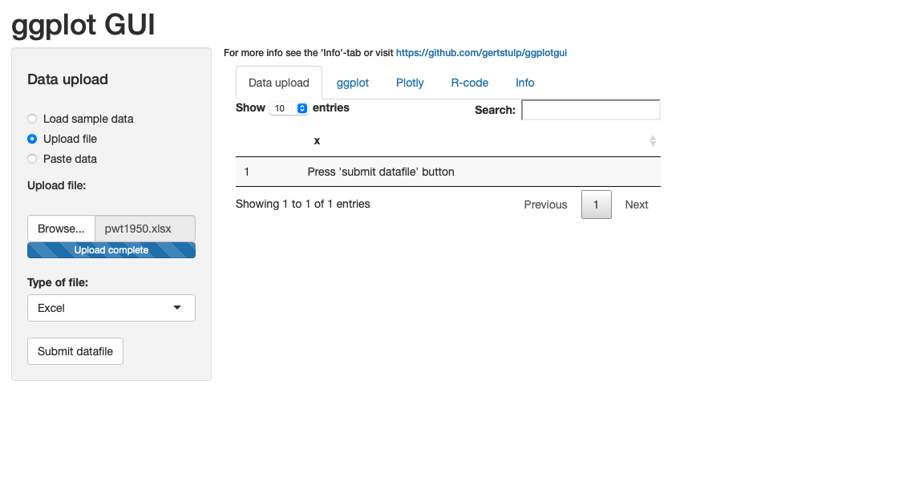
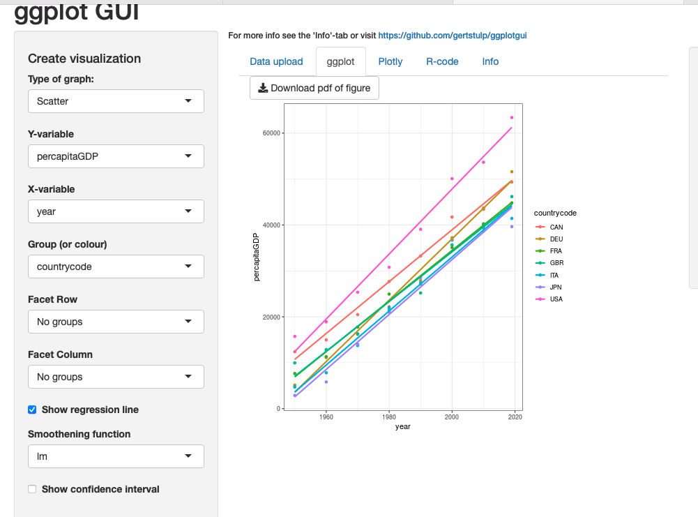
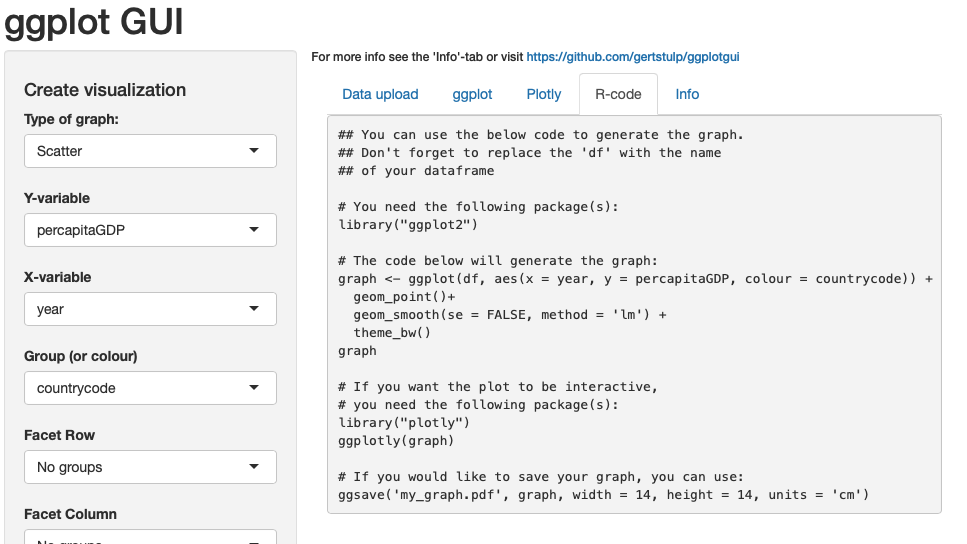

## はじめに
PWT:
https://www.rug.nl/ggdc/productivity/pwt/?lang=en

Rの初歩：
https://oku.edu.mie-u.ac.jp/~okumura/stat/

# 棒グラフ(G7の一人あたりGDPと人口)

```{r}
library(readxl)
pwt2019 <- read_excel("pwt2019.xlsx")

## 一人あたりGDP
barplot(pwt2019$percapitaGDP,names.arg=pwt2019$countrycode)

## 人口
barplot(pwt2019$pop,names.arg=pwt2019$countrycode)

```

# 散布図（人口とGDP）

- RPubsで人口とGDPの散布図を公開。

- plot(x, y)

- https://oku.edu.mie-u.ac.jp/~okumura/stat/090509b.html

```{r}
plot(pwt2019$rgdpe,pwt2019$pop)

plot(pwt2019$rgdpe,pwt2019$pop, log="xy")

plot(pwt2019$rgdpe,pwt2019$pop, log="xy", xlab="GDP", ylab="Population")

plot(pwt2019$percapitaGDP,pwt2019$pop, log="xy", xlab="Percapita GDP", ylab="Population")
```

# 折れ線グラフ（一人当たりGDP）

- 一人当たりGDPの折れ線グラフ

- https://oku.edu.mie-u.ac.jp/~okumura/stat/090503b.html


```{r}
library(readxl)
pwt1950 <- read_excel("pwt1950.xlsx")
plot(pwt1950$year,pwt1950$percapitaGDP)

plot(pwt1950$year,pwt1950$percapitaGDP,type = "o")

plot(pwt1950$year,pwt1950$percapitaGDP,type = "l")

jpn<-subset(pwt1950,countrycode=="JPN")
plot(jpn$year,jpn$percapitaGDP,type = "o")

```


```{r}
library(readxl)
pwt1950 <- read_excel("pwt1950.xlsx")
jpn<-subset(pwt1950,countrycode=="JPN")
usa<-subset(pwt1950,countrycode=="USA")

plot(usa$year,usa$percapitaGDP,type = "o",ylim=c(1000,80000))
points(jpn$year,jpn$percapitaGDP,type = "o")
text(1990,45000,"USA")
text(1990,25000,"JPN")

#Germany versus Japan
deu<-subset(pwt1950,countrycode=="DEU")

plot(deu$year,deu$percapitaGDP,type = "o",ylim = c(1000,80000))
points(jpn$year,jpn$percapitaGDP,type = "o")
text(2010,47000,"DEU")
text(2010,35000,"JPN")

```


# 日本とイギリス
- 色を指定する
- 色の参考) https://bioid.hatenablog.jp/entry/2019/10/19/220221

```{r}
#UK versus Japan
GBR<-subset(pwt1950,countrycode=="GBR")

plot(GBR$year,GBR$percapitaGDP,type = "o",ylim = c(1000,80000),col=4)
points(jpn$year,jpn$percapitaGDP,type = "o")
text(2010,47000,"GBR")
text(2010,35000,"JPN")
```


# 日本とフランス

```{r}
library(readxl)
pwt1950 <- read_excel("pwt1950.xlsx")
JPN<-subset(pwt1950,countrycode=="JPN")
FRA<-subset(pwt1950,countrycode=="FRA")
plot(FRA$year,FRA$percapitaGDP,type = "o",ylim =  c(1000,80000),col=4)
points(JPN$year,JPN$percapitaGDP,type = "o")
text(2010,45000,"FRA")
text(2010,35000,"JPN")


```

# GUIで作成1
- library(guiplot)
- guiplot()で別ウィンドウが開き、グラフを作成。
- コンソールのコードを使えば、グラフを再現できる。

```{r}
library(guiplot)
library(ggplot2)

ggplot() + geom_line(data = pwt1950, aes(x = year, y = percapitaGDP, 
    group = countrycode, color = countrycode)) + geom_point(data = pwt1950, 
    aes(x = year, y = percapitaGDP, group = countrycode, color = countrycode)) + 
    theme_gray()
```


# GUIで作成2
- ggplot GUI
- https://shiny.gmw.rug.nl/ggplotgui/
- 上記で、グラフを作成。
- 出力されるコードを使えば、グラフを再現できる。
- library("ggplot2")が必要。
- library("plotly")も必要。
- データ名称をdfに変更しておく。

### (1)データ読み込み


### (2)グラフ作成


### (3)Rコード


```{r message=FALSE, warning=FALSE, paged.print=FALSE}
library(readxl)
df <- read_excel("pwt1950.xlsx")
```


```{r message=FALSE, warning=FALSE}
## You can use the below code to generate the graph.
## Don't forget to replace the 'df' with the name
## of your dataframe

# You need the following package(s):
library("ggplot2")

# The code below will generate the graph:
graph <- ggplot(df, aes(x = year, y = percapitaGDP, colour = countrycode)) +
  geom_point()+
  geom_smooth(se = FALSE, method = 'lm')+
  labs(colour = '') +
  theme_bw() +
  theme(
    legend.position = 'right'
  )
graph

# If you want the plot to be interactive,
# you need the following package(s):
library("plotly")
ggplotly(graph)

# If you would like to save your graph, you can use:
ggsave('my_graph.pdf', graph, width = 14, height = 14, units = 'cm')

```


