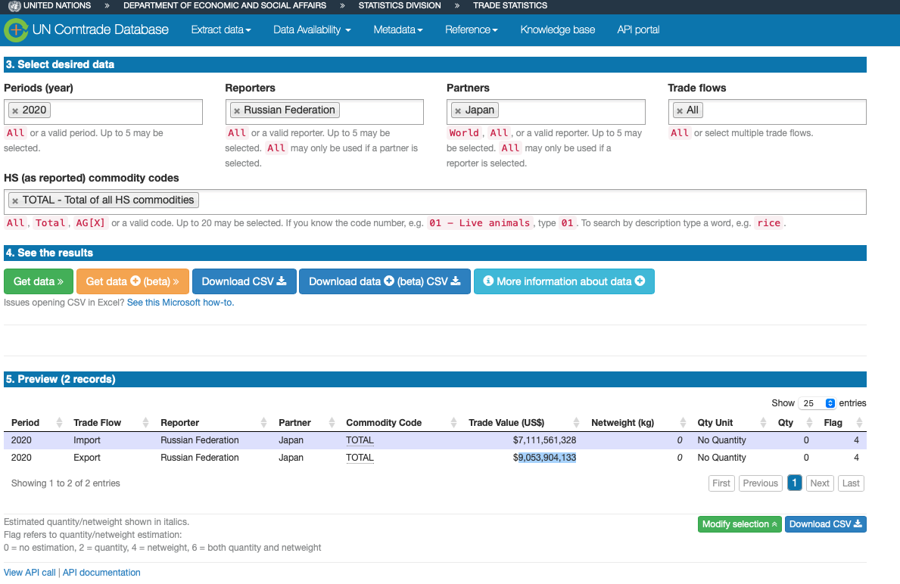
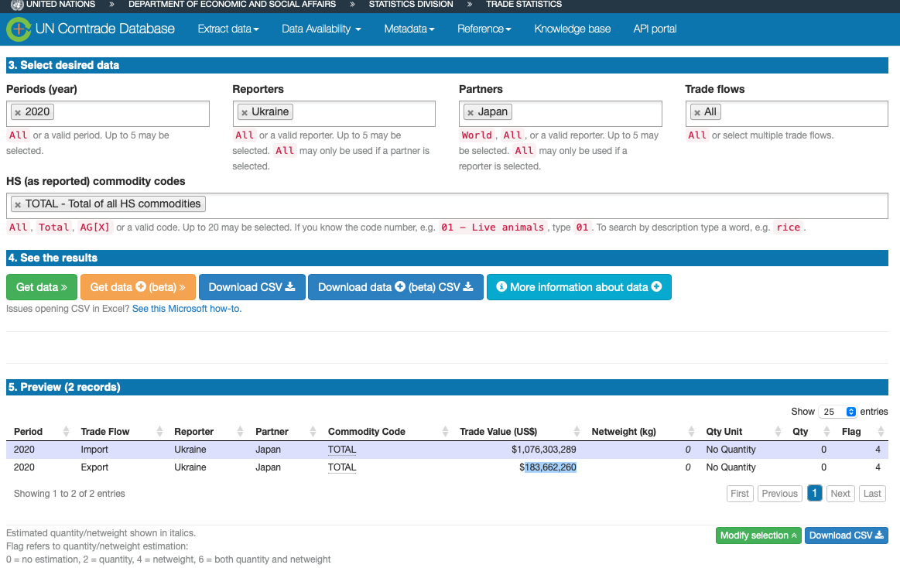

# 棒グラフの作成

- ここで、 「trade\$import」は、棒グラフにする変数である輸入額

- また、 「trade\$origins」は、棒グラフの下に表示する国名

```{r message=FALSE, warning=FALSE}
library(readr)
trade <- read_csv("trade.csv")
barplot(trade$import,names.arg=trade$origins)
```

# Leafletのインストール

```{r message=FALSE, warning=FALSE}
install.packages("leaflet")
```

# Leafletの基本

- 参考：https://rstudio.github.io/leaflet/

- 参考：https://kazutan.github.io/JapanR2015/leaflet_d.html


## pipe operator ( %\>% )を用いない書き方

```{r message=FALSE, warning=FALSE}
library(leaflet)
m <- leaflet()
m <- addTiles(m)
m <- addMarkers(m, lng=174.768, lat=-36.852, popup="The birthplace of R")
 m
```

## pipe operator ( %\>% )を用いる書き方

pipe operatorはcontrol+shift+mを同時に押すことで出ます。

```{r message=FALSE, warning=FALSE}
library(leaflet)
m <- leaflet() %>%
addTiles() %>% # Add default OpenStreetMap map tiles
addMarkers(lng=174.768, lat=-36.852, popup="The birthplace of R")
m 

```


# 地図上に東京駅を示す

- 東京駅(緯度35.68207281264243, 経度139.76693168096068)
- 東京駅の緯度経度をgoogle mapで確認
-- https://goo.gl/maps/RRwEu6EzcK4TjCgQ7
- 参考) 奥村 晴彦氏、leaflet
-- https://oku.edu.mie-u.ac.jp/~okumura/stat/leaflet.html

```{r}
leaflet() %>%
  addTiles() %>% #規定の地図背景を使う
  addMarkers(lng=139.76727500369722, lat=35.68207281264243,  popup="Tokyo Station") #ポップアップの経度緯度指定
```

# trade.csvデータに掲載の輸出国を表示。
```{r message=FALSE, warning=FALSE}
library(readr)
trade <- read_csv("trade.csv")

library(leaflet)
x <- leaflet() %>%
  addTiles() %>%  # Add default OpenStreetMap map tiles
  addMarkers(lng=trade$longitude.x, lat=trade$latitude.x, popup=trade$origins) 
x

```


# 輸出国の輸出額のサークルを作成する。

addCircles()でサークルを作れる。
weightはサークルの外周の線の太さ。
radiusはサークルの大きさ。
```{r message=FALSE, warning=FALSE}

library(readr)
trade <- read_csv("trade.csv")

library(leaflet)
x <- leaflet() %>%
  addTiles() %>%  # Add default OpenStreetMap map tiles
addCircles(lng=trade$longitude.x, lat=trade$latitude.x, weight = 1,
    radius = trade$import*100000, popup=trade$origins)
x
```

# 輸出国の輸出額のサークルを作成する（パイプ演算子使わない方法）。
```{r message=FALSE, warning=FALSE}

library(readr)
trade <- read_csv("trade.csv")

library(leaflet)
x<-leaflet()
x<-addTiles(x)
x<-addCircles(x,lng = trade$longitude.x,lat = trade$latitude.x,radius = trade$import*100000,popup = trade$origins)
x
```


# 線でつなぐ
addPolylinesで線を描ける。
線は、データ上、前後の国の緯度と経度を結ぶ。
```{r message=FALSE, warning=FALSE}
library(readr)
trade <- read_csv("trade.csv")
line <- read_csv("line.csv")
USA<-subset(line,country=="USA"|country=="JPN")

library(leaflet)
x<-leaflet()
x<-addTiles(x)
x<-addPolylines(x,lng=USA$long,lat = USA$lat, weight=USA$import)
x
```

# 線でつなぐ
addPolylinesで線を描ける。
線は、データ上、前後の国の緯度と経度を結ぶ。
そのため、日本とアメリカだけのデータ、日本とオーストラリアだけのデータ・・・を作成する。
```{r message=FALSE, warning=FALSE}
library(readr)
trade <- read_csv("trade.csv")
line <- read_csv("line.csv")
USA<-subset(line,country=="USA"|country=="JPN")
AUS<-subset(line,country=="AUS"|country=="JPN")
CHN<-subset(line,country=="CHN"|country=="JPN")
NZL<-subset(line,country=="NZL"|country=="JPN")
DEU<-subset(line,country=="DEU"|country=="JPN")


library(leaflet)
x<- leaflet()
x<- addTiles(x)
x<-addPolylines(x,lng=USA$long,lat = USA$lat, weight=USA$import)
x<-addPolylines(x,lng=AUS$long,lat = AUS$lat, weight=AUS$import)
x<-addPolylines(x,lng=CHN$long,lat = CHN$lat, weight=CHN$import)
x<-addPolylines(x,lng=NZL$long,lat = NZL$lat, weight=NZL$import)
x<-addPolylines(x,lng=DEU$long,lat = DEU$lat, weight=DEU$import)

x
```

# 航路1

- 日米を直線ではなく、航路で曲線で結ぶ
- まずlibrary(geosphere)を用いて、緯度と経度で表される点と点の間をつなぐ点の集合を求める。
- ここで使うgcIntermediate()という函数は、２地点の航路を求める。
- addStartEnd = TRUE は出発点と到着点を結果の中に含めることを指定。

- 参考：https://id.fnshr.info/2018/05/20/geosphere2/
```{r message=FALSE, warning=FALSE}
#データ
library(readr)
line <- read_csv("line.csv")
USA<-subset(line,country=="USA"|country=="JPN")

#緯度経度登録
library(geosphere)
JPNcenter <- c(137.96, 37.54)
USAcenter <- c(-112.98, 45.72)

#地図1
gcUSA1 <- gcIntermediate(JPNcenter, USAcenter, addStartEnd = TRUE)
library(leaflet)
y<- leaflet()
y<- addTiles(y)
y<-addPolylines(y,data = gcUSA1,col="red")
y


```

## 航路2: 日付変更線を考慮して航路を設定。
- 日米間で日付変更線またぐため、breakAtDateLine=TRUEと設定。
- sp = TRUEという設定することで空間データとしてRが認識。
- 日付変更線を考慮して地図上では航路を２分割するため、sp=TRUEという設定が必要になる。
- ウェイトとして、日米の貿易額を用いる。

```{r message=FALSE, warning=FALSE}
#データ
library(readr)
line <- read_csv("line.csv")
JPN<-subset(line,country=="JPN")
USA<-subset(line,country=="USA")

#緯度経度登録
library(geosphere)
JPNcenter <- JPN[, c(3:4)]
USAcenter <- USA[, c(3:4)]

#地図2
gcUSA2 <- gcIntermediate(JPNcenter, USAcenter,sp = TRUE,addStartEnd = TRUE, breakAtDateLine=TRUE)

library(leaflet)
y<- leaflet()
y<- addTiles(y)
y<-addPolylines(y,data = gcUSA2,col="blue",weight = USA$import)
y
```


## 国の追加

```{r message=FALSE, warning=FALSE}
#データ
library(readr)
line <- read_csv("line.csv")
JPN<-subset(line,country=="JPN")
USA<-subset(line,country=="USA")
AUS<-subset(line,country=="AUS")
CHN<-subset(line,country=="CHN")
NZL<-subset(line,country=="NZL")
DEU<-subset(line,country=="DEU")

#緯度経度登録
library(geosphere)
JPNcenter <- JPN[, c(3:4)]
USAcenter <- USA[, c(3:4)]
AUScenter <- AUS[, c(3:4)]
CHNcenter <- CHN[, c(3:4)]
NZLcenter <- NZL[, c(3:4)]
DEUcenter <- DEU[, c(3:4)]

#地図2
gcUSA2 <- gcIntermediate(JPNcenter, USAcenter,sp = TRUE,addStartEnd = TRUE, breakAtDateLine=TRUE)
gcAUS2 <- gcIntermediate(JPNcenter, AUScenter,sp = TRUE,addStartEnd = TRUE, breakAtDateLine=TRUE)
gcCHN2 <- gcIntermediate(JPNcenter, CHNcenter,sp = TRUE,addStartEnd = TRUE, breakAtDateLine=TRUE)
gcNZL2 <- gcIntermediate(JPNcenter, NZLcenter,sp = TRUE,addStartEnd = TRUE, breakAtDateLine=TRUE)
gcDEU2 <- gcIntermediate(JPNcenter, DEUcenter,sp = TRUE,addStartEnd = TRUE, breakAtDateLine=TRUE)

library(leaflet)
y<- leaflet()
y<- addTiles(y)
y<-addPolylines(y,data = gcUSA2,col="blue",weight = USA$import,
                label =USA$import,popup = "USA")
y<-addPolylines(y,data = gcAUS2,col="blue",weight = AUS$import,
                label =AUS$import,popup = "AUS")
y<-addPolylines(y,data = gcCHN2,col="blue",weight = CHN$import,
                label =CHN$import,popup = "CHN")
y<-addPolylines(y,data = gcNZL2,col="blue",weight = NZL$import,
                label =NZL$import,popup = "NZL")
y<-addPolylines(y,data = gcDEU2,col="blue",weight = DEU$import,
                label =DEU$import,popup = "DEU")

y
```


# 航路3

- 緯度と経度で表される点と点の間をつなぐ点の集合を求める
- gcIntermediate()という函数は、２地点の航路を求める。
- addStartEnd = TRUE は出発点と到着点を結果の中に含めることを指定
- 日米間で日付変更線またぐため、breakAtDateLine=TRUEと設定。trade[,4:5]とtrade[,6:7]は輸出国と輸入国の緯度経度。
- オブジェクトflowsは通常のデータと異なる地理的データ
- 参考：https://id.fnshr.info/2018/05/20/geosphere2/

## 準備
```{r message=FALSE, warning=FALSE}
library(readr)
trade <- read_csv("trade.csv")

library(geosphere)

flows <- gcIntermediate(trade[,4:5], trade[,6:7], sp = TRUE, addStartEnd = TRUE, breakAtDateLine=TRUE) 

#輸入データ
flows$import <- trade$import
#輸出国
flows$origins <- trade$origins
#輸入国
flows$destinations <- trade$destinations

```

## 地図(1) 基礎
- 色分けをlibrary(RColorBrewer)によって自動的に行う。
- 参考：https://stats.biopapyrus.jp/r/graph/rcolorbrewer.html
```{r message=FALSE, warning=FALSE}
#地図描画に必要なパッケージの読み込み
library(leaflet)
#グラフを描く際に色を指定するためのパッケージの読み込み
library(RColorBrewer)

#貿易フローの矢印をクリックした時にラベル（輸出国、輸入国、貿易額）が出てくるように設定。
#paste0()は複数の文字列を結合する関数。
countrylabel <- paste0(flows$origins, " to ", 
                flows$destinations, ': ', 
                as.character(flows$import))

#輸出国別に貿易フローの矢印の色分け指定（4色、Set2は色調の種類）
pal <- colorFactor(brewer.pal(4, 'Set2'), flows$origins)
#参考：https://stats.biopapyrus.jp/r/graph/rcolorbrewer.html

#貿易フロー地図の描画
#データはflows、ウェイトは輸入額。輸出国別に色分け。
#(1) 基礎編 「~」はベクトルであることを示す
leaflet() %>%
  addTiles() %>% #規定の地図背景を使う
  addPolylines(data = flows, weight = ~import, label = countrylabel, 
               group = ~origins, color = ~pal(origins))  #貿易フローのライン
```

## 地図(2) 応用
```{r message=FALSE, warning=FALSE}
leaflet() %>%
  addProviderTiles('CartoDB.Positron') %>% #サードパーティーの地図背景を使う
  addPolylines(data = flows, weight = ~import, label = countrylabel, 
               group = ~origins, color = ~pal(origins)) %>% #貿易フローのライン
  addLayersControl(overlayGroups = unique(flows$origins), 
                   options = layersControlOptions(collapsed = FALSE)) #貿易フローのラインを操作するボタン
```


# ロシアとウクライナから日本への輸出

- UNComtradeで貿易額調べる
- https://comtrade.un.org/data/

{width=80%}
{width=80%}

- ロシアの地理的中心
- https://en.wikipedia.org/wiki/Lake_Vivi


```{r}
#緯度経度
JPNcenter <- c(137.96, 37.54)
RUScenter<-c(93.85, 66.755)
UKRcenter<-c(30.51069,50.46730)

#航路の計算
library(geosphere)
gcRUS <- gcIntermediate(JPNcenter, RUScenter, addStartEnd = TRUE)
gcUKR <- gcIntermediate(JPNcenter, UKRcenter, addStartEnd = TRUE)

#地図の描画
y<- leaflet()
y<- addTiles(y)
#線の太さは貿易額
y<-addPolylines(y,data = gcRUS,col="blue",weight = 9053904133/100000000)
y<-addPolylines(y,data = gcUKR,col="red",weight = 183662260/100000000)
y
```


