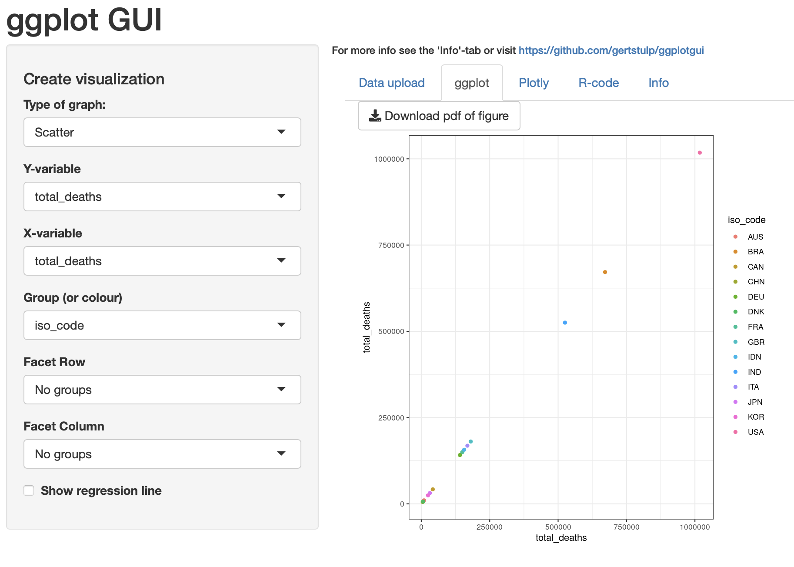
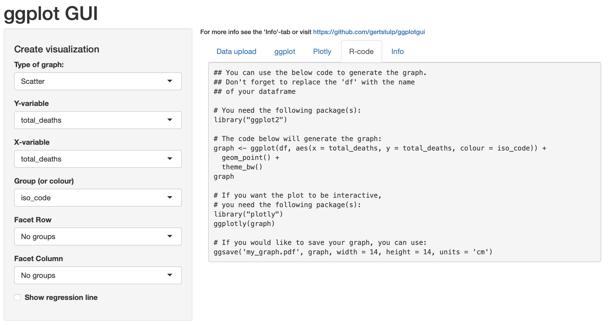

# 正規分布
```{r}
x=(-10:10)
y=dnorm(x)
plot(x,y)


```


# 中心極限定理
```{r}
x=runif(1000000)
hist(x, freq=FALSE)
x=x+runif(1000000)+runif(1000000)+runif(1000000)
hist(x,freq = FALSE)


```


# 平均が18、標準偏差10の正規分布
```{r}
curve(dnorm(x,18,10),0,40)

X=c(28,13,16,28,29,12,14,12,10)
hist(X)
mean<-mean(X)
low<-mean-1.96*(10/3)
upper<-mean+1.96*(10/3)
mean
low
upper

```

# COVID19の感染者数と死者数の関係を表す散布図
```{r}
library(readxl)
covid <- read_excel("covid.xlsx")
plot(covid$total_cases,covid$total_deaths)

```

# COVID19の感染者数と死者数の関係を表す散布図&回帰直線
```{r}
library(readxl)
covid <- read_excel("covid.xlsx")
result<-lm(total_deaths~total_cases,data = covid)
summary(result)

plot(covid$total_cases,covid$total_deaths)
abline(result)

```

# ggplot GUI　ローカル

- library(ggplotgui)
- ggplot_shiny()


# ggplot GUI オンライン
- https://shiny.gmw.rug.nl/ggplotgui/
- 上記で、グラフを作成。
- ネットの状態により接続が不安定で、うまく行かないことある。

- dataはOur World in Data より：
https://ourworldindata.org/coronavirus
https://github.com/owid/covid-19-data/tree/master/public/data






## データ名称をdfに変更しておく。

```{r}
library(readxl)
covid <- read_excel("covid.xlsx")
df<-covid
```


## ggplot GUIで出力されるコードをコピー＆ペーストして、グラフを再現。
- library(“ggplot2”)が必要。
- library(“plotly”)も必要。

```{r message=FALSE, warning=FALSE}
## You can use the below code to generate the graph.
## Don't forget to replace the 'df' with the name
## of your dataframe

# You need the following package(s):
library("ggplot2")

# The code below will generate the graph:
graph <- ggplot(df, aes(x = total_cases, y = total_deaths, colour = iso_code)) +
  geom_point() +
  theme_bw()
graph

# If you want the plot to be interactive,
# you need the following package(s):
library("plotly")
ggplotly(graph)

# If you would like to save your graph, you can use:
ggsave('my_graph.pdf', graph, width = 14, height = 14, units = 'cm')
```


# 致死率（=死者数/感染者数）と一人あたりGDPの関係を調べる
```{r}

library(readxl)
covid <- read_excel("covid.xlsx")
covid$cfr<-covid$total_deaths/covid$total_cases
# las = 2によりx軸のラベルを90度回転。
# cex.names = 0.80によりx軸のラベルを小さく。
barplot(covid$cfr,names.arg = covid$iso_code,cex.names = 0.80,las=2)
result<-lm(cfr~gdp_per_capita,data=covid)
summary(result)
plot(covid$gdp_per_capita,covid$cfr)
abline(result)
```


