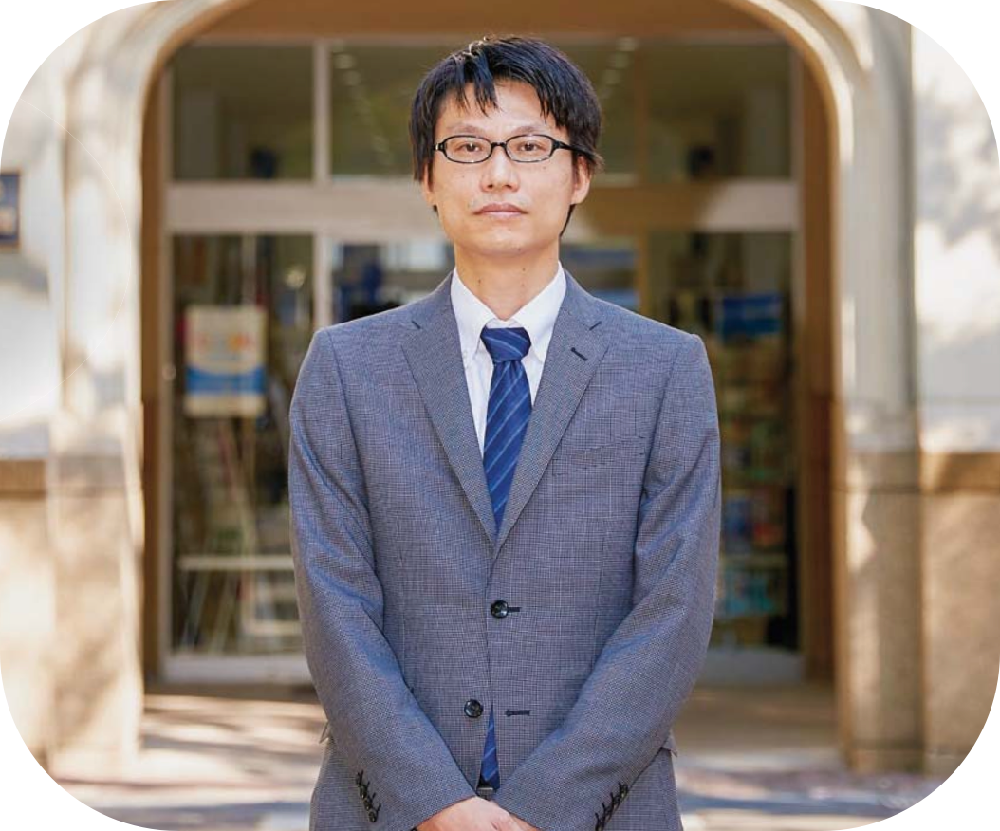

## Welcome to My Pages

 

I am an Associate Professor in the College of Economics at Aoyama Gakuin University. My research focuses on the internationalization of Japanese firms and the effects of globalization on economic inequality, drawing on Japanese micro-level data. I have also conducted research on trade in cultural goods and the impact of natural disasters on manufacturing establishments. Currently, I am working on the ownership structure of foreign direct investment using firm-level data.

Outside of my academic work, I enjoy swimming and taking short day trips with my family. I also love cats.

*   [CV](/cv.md)
*   [Research](/research.md)
*   [Photos](photos/photos.md)
*   [Japanese](/japanese.md)

**Office Address**   
College of Economics, Aoyama Gakuin University  
4-4-25 Shibuya, Shibuya-ku, Tokyo 150-8366, JAPAN  

[Aoyama Campus](https://www.aoyama.ac.jp/en/outline/map_directions.html)  
