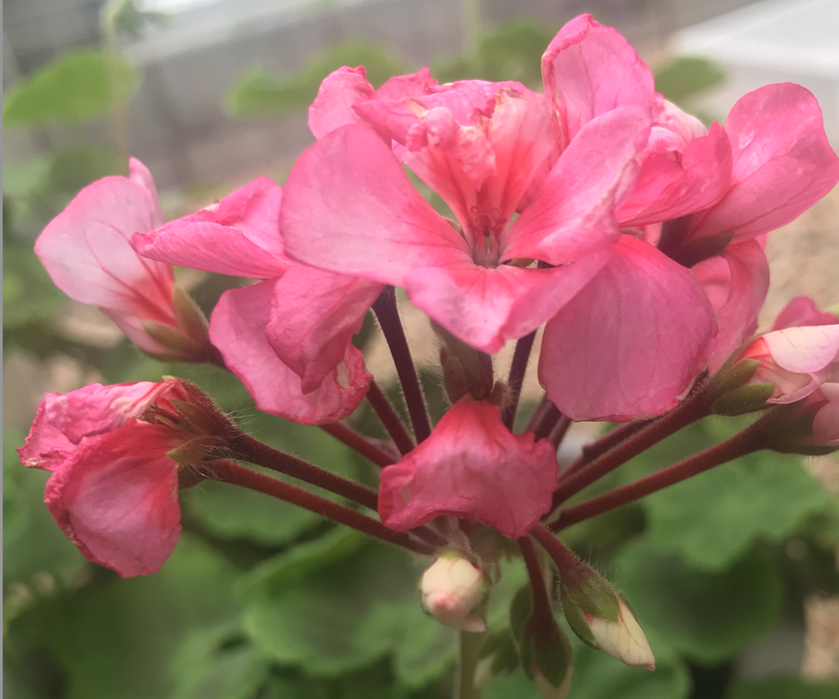

# Photo Gallery 

## Calibrachoa (_Kariburakoa_) in November 2023.

## Liriope Muscari (_Yabu Ran_) in September 2023.

## Morning Glory (_Asagao_) in September 2023.

## Neko in September 2023.

## Morning Glory (_Asagao_) in August 2023.

## Angelonia (_Angeronia_) in May 2023.

## Geranium (_Zeraniumu_) in June 2023.

## Geranium (_Zeraniumu_) in May 2023.

## Pansy and Tulip in April 2023.

## Tulip in March 2023.

## Kana-chan, Gomphrena globosa (SenNichiKou), and Catharanthus roseus (NichiNichiSou) in September 2022.

